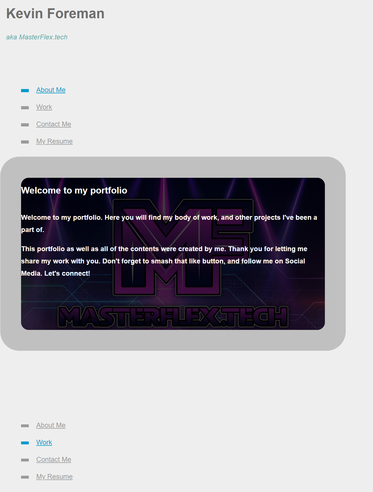

# My Portfolio

## Table of Contents
### General Info
### Technologies
### Setup
### Screenshot

## General info
This project is to showcase some of my work, and provide general information about me. The Masterflex.tech website is one I created with Wordpress long before I started coding. Eventually I will re-tool the entire site using my new-found knowledge of HTML, CSS, advanced CSS, and JavaScript, stay tuned!

## Technologies
Project is modified with:
* Visual Studio Code Version: 1.64.0 (user setup)
* OS: Windows_NT x64 10.0.22543
* css
* markdown

## Setup
To launch the page click on the link provided below

Link to deployed location:
https://kevin-foreman.github.io/week2-portfolio/

* Screenshot of landing page

